# Jarkom-Modul-2-E06-2023
Berikut adalah repository dari kelompok E06 untuk pengerjaan Praktikum Modul 2 Jaringan Komputer. Repository ini akan berisikan dokumentasi cara pengerjaan tiap soal, screenshot output, dan kendala yang dialami.

# Anggota Kelompok
| Nama | NRP | 
| --- | --- |
| Muhammad Hafidh Rosyadi | 5025211013 |
| Kartika Diva Asmara Gita | 5025211039 |

# Dokumentasi Pengerjaan Soal
## Nomor 1
### Soal
Yudhistira akan digunakan sebagai DNS Master, Werkudara sebagai DNS Slave, Arjuna merupakan Load Balancer yang terdiri dari beberapa Web Server yaitu Prabakusuma, Abimanyu, dan Wisanggeni. Buatlah topologi dengan pembagian sebagai berikut. Folder topologi dapat diakses pada drive berikut 

### Jawaban
Berikut merupakan topologi yang telah kelompok kami buat.

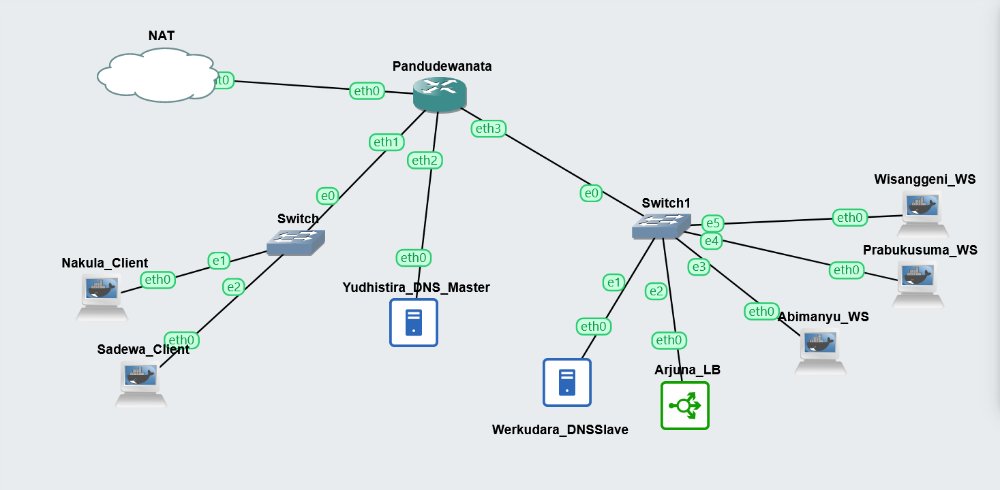

## Nomor 2
### Soal
Buatlah website utama pada node arjuna dengan akses ke arjuna.yyy.com dengan alias www.arjuna.yyy.com dengan yyy merupakan kode kelompok.

### Jawaban
Untuk membuat domain DNS master/Yudhistira dibutuhkan instalasi bind sebagai berikut:

```
apt-get update
apt-get install bind9 -y
```
Kemudian meingisikan konfigurasi pada `/etc/bind/named.conf.local` sebagai berikut:

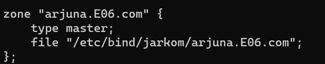

kemudian buat folder untuk menyimpan domain dalam hal ini adalah `jarkom`. Kemudian lakukan pengkopian template file yang ada di `/etc/bind/db.local` ke file yang tertaut pada konfigurasi diatas.
```
mkdir /etc/bind/jarkom
cp /etc/bind/db.local /etc/bind/jarkom/arjuna.E06.com
```

Kemudian ubah isi file `/etc/bind/jarkom/arjuna.E06.com` menjadi seperti berikut, dengan mengubah localhost menjadi domain yang dituju dan mengubah IP menjadi IP dari arjuna, dan menambahkan alias atau CNAME.

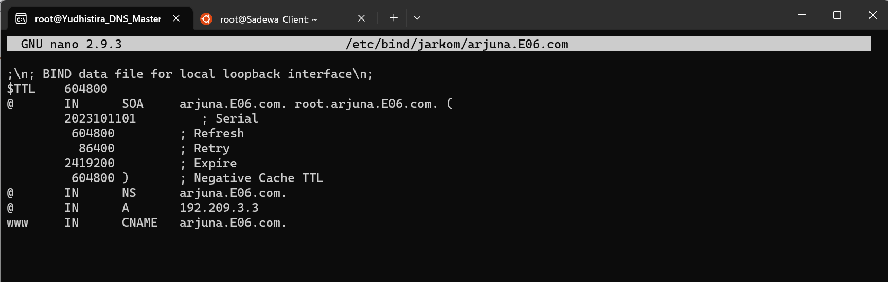

kemudian lakukan restart bind.

```
service bind9 restart
```

Untuk melakukan testing, dapat dilakukan pada client dengan menginstall beberapa hal dan melakukan penyambungan IP, sebagai berikut

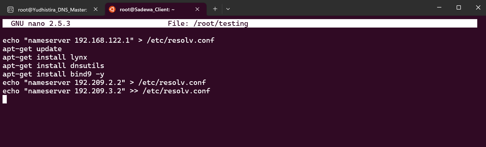

kemudian dilakukan ping pada arjuna.E06.com dan www.arjuna.E06.com untuk melakukan testing.

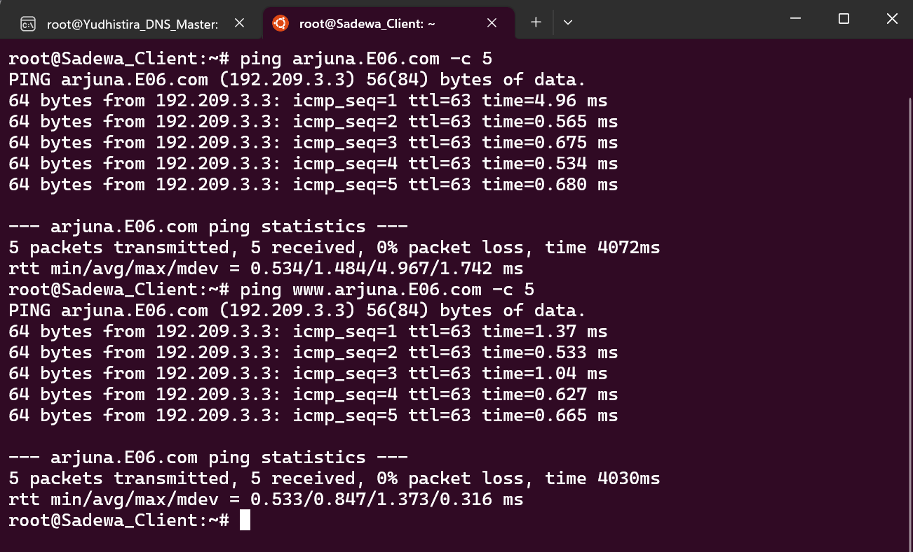

## Nomor 3
### Soal
Dengan cara yang sama seperti soal nomor 2, buatlah website utama dengan akses ke abimanyu.yyy.com dan alias www.abimanyu.yyy.com.

### Jawaban
menambahkan konfigurasi pada `/etc/bind/named.conf.local` sebagai berikut:

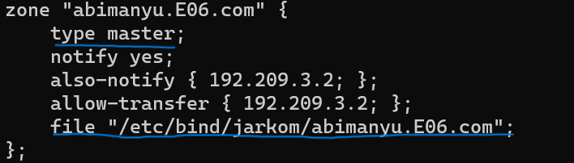

Kemudian lakukan pengkopian template file yang ada di `/etc/bind/db.local` ke file yang tertaut pada konfigurasi diatas.

```
cp /etc/bind/db.local /etc/bind/jarkom/abimanyu.E06.com
```

Kemudian ubah isi file `/etc/bind/jarkom/abimanyu.E06.com` menjadi seperti berikut, dengan mengubah localhost menjadi domain yang dituju dan mengubah IP menjadi IP dari Abimanyu, dan menambahkan alias atau CNAME.


kemudian lakukan restart bind.

```
service bind9 restart
```

kemudian dilakukan ping pada abimanyu.E06.com dan www.abimanyu.E06.com untuk melakukan testing.

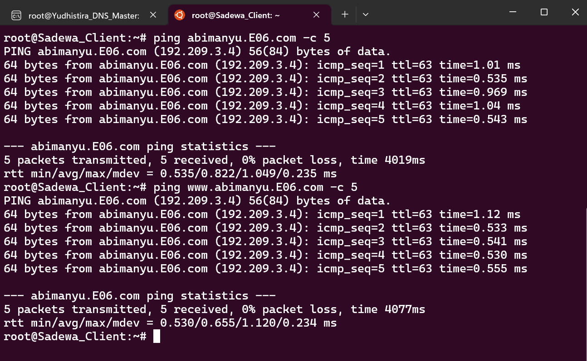


## Nomor 4
### Soal
Kemudian, karena terdapat beberapa web yang harus di-deploy, buatlah subdomain parikesit.abimanyu.yyy.com yang diatur DNS-nya di Yudhistira dan mengarah ke Abimanyu.

### Jawaban
untuk membuat subdomain perlu dilakukan penambahan pada `/etc/bind/jarkom/abimanyu.E06.com` sebagai berikut:

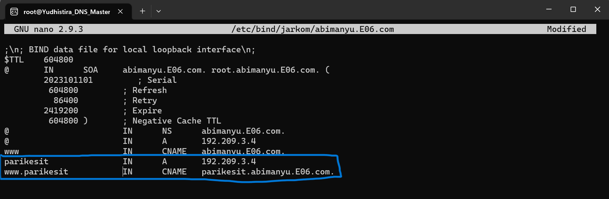

kemudian lakukan restart bind.

```
service bind9 restart
```

kemudian dilakukan ping pada parikesit.abimanyu.E06.com dan www.parikesit.abimanyu.E06.com untuk melakukan testing.

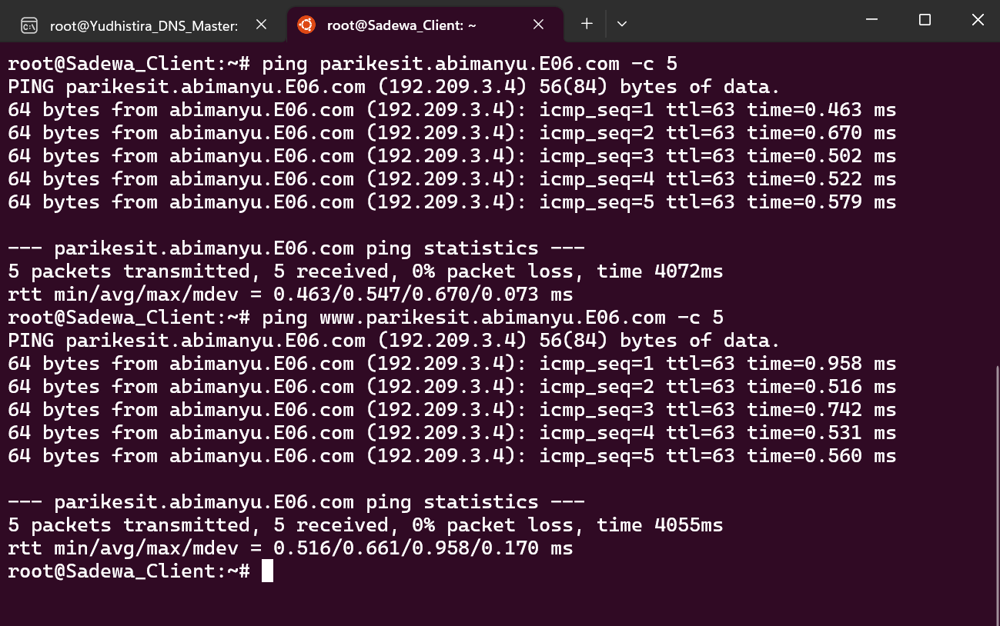

## Nomor 5
### Soal
Buat juga reverse domain untuk domain utama. (Abimanyu saja yang direverse)

### Jawaban
Menambahkan kofigurasi sebagai berikut pada `/etc/bind/named.conf.local` di Yudhistira:

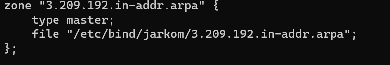


kemudian mengisi file  `/etc/bind/jarkom/3.209.192.in-addr.arpa` sebagai berikut

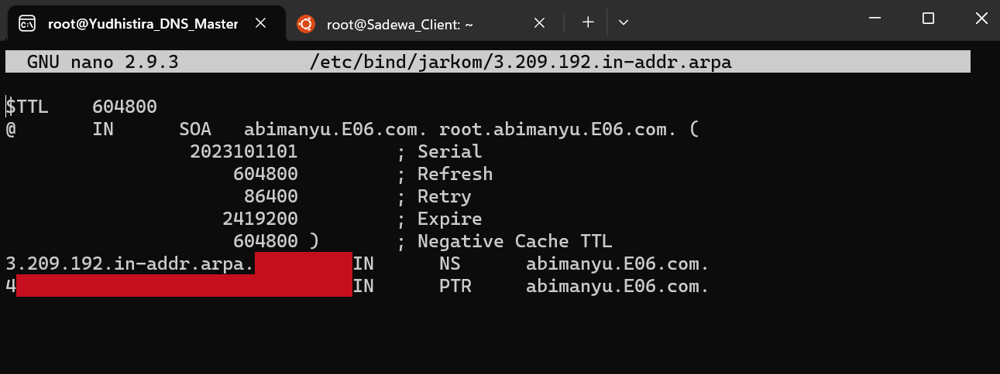

kemudian lakukan restart bind.

```
service bind9 restart
```
untuk testing dapat dilakukan dengan command:
```
host -t PTR 192.209.3.4
```
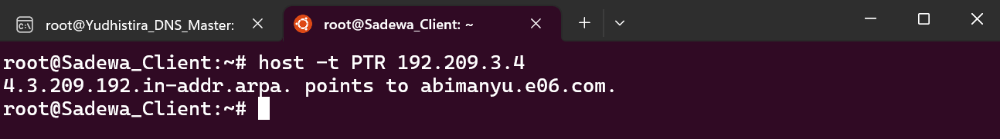

## Nomor 6
### Soal
Agar dapat tetap dihubungi ketika DNS Server Yudhistira bermasalah, buat juga Werkudara sebagai DNS Slave untuk domain utama.

### Jawaban
IP Werkudara dihubungkan dengan Yudhistira pada /etc/bind/named.conf.local di Yudhistira, sebagai berikut:

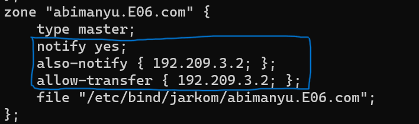

Selanjutnya melakukan setting agar Werkudara menjadi slave pada /etc/bind/named.conf.local di Werkudara.

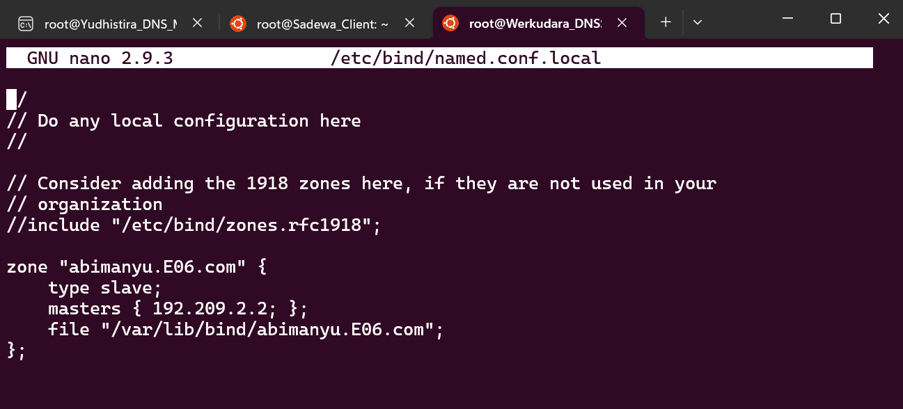

kemudian untuk melakukan testing dapat dilakukan penghentian service dari bind di master/Yudhistira dengan command:
```
service bind9 stop
```
dan dilakukan ping. apabila masih bisa, maka slave telah tersambung.

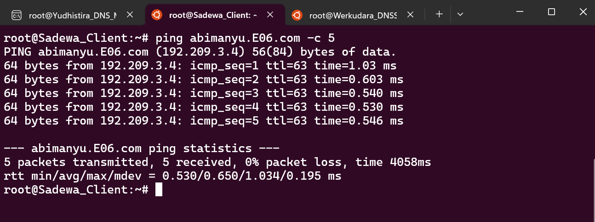


## Nomor 7
### Soal
Seperti yang kita tahu karena banyak sekali informasi yang harus diterima, buatlah subdomain khusus untuk perang yaitu baratayuda.abimanyu.yyy.com dengan alias www.baratayuda.abimanyu.yyy.com yang didelegasikan dari Yudhistira ke Werkudara dengan IP menuju ke Abimanyu dalam folder Baratayuda.

### Jawaban
#### Yudhistira
Pada `/etc/bind/jarkom/abimanyu.E06.com` tambahkan konfigurasi tambahan sebagai berikut:

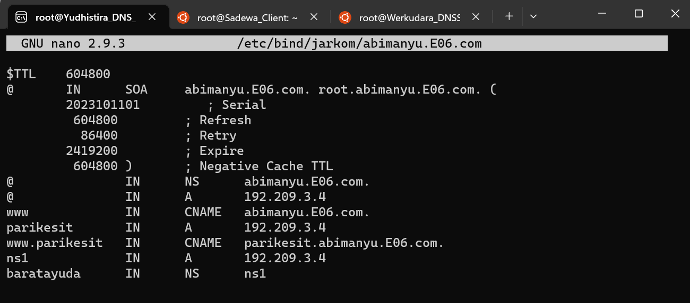

Kemudian pada `/etc/bind/named.conf.options`comment `dnssec-validation auto;` dan tambahkan `allow-query{any;};`.

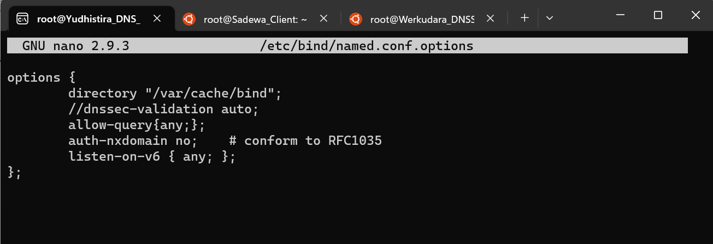

Kemudian ubah konfigurasi `/etc/bind/named.conf.local` menjadi seperti berikut:

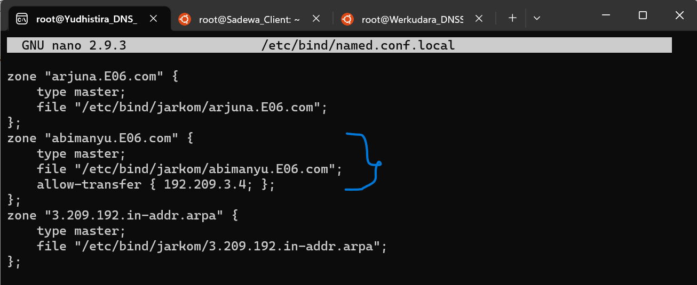

#### Werkudara
pada `/etc/bind/named.conf.options` comment `dnssec-validation auto;` dan tambahkan `allow-query{any;};`.

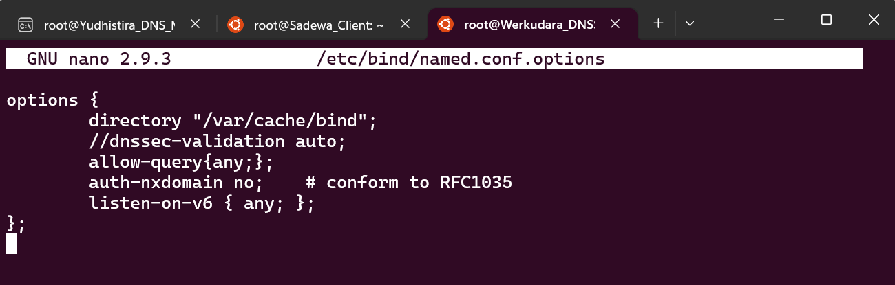

Kemudian ubah konfigurasi `/etc/bind/named.conf.local` menjadi seperti berikut:

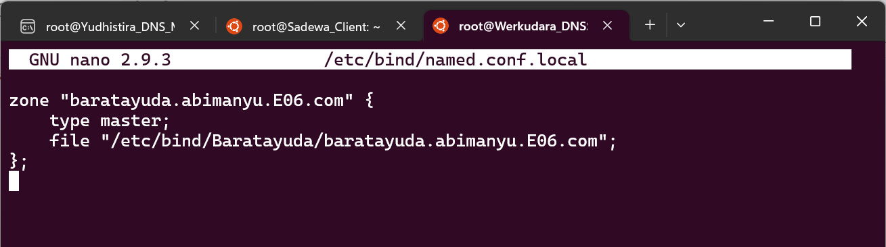

Kemudian buat direktori `Baratayuda` sesuai dengan nama file yang terhubung dengan konfigurasi diatas dan pindahkan file template pada db.local.

```
mkdir /etc/bind/Baratayuda
cp /etc/bind/db.local /etc/bind/Baratayuda/baratayuda.abimanyu.E06.com
```
kemudian ubah file `/etc/bind/Baratayuda/baratayuda.abimanyu.E06.com` menjadi sebagai berikut:

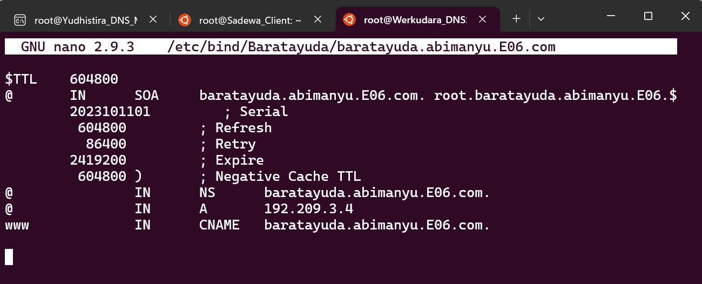

Terakhir lakukan pengetesan pada client.

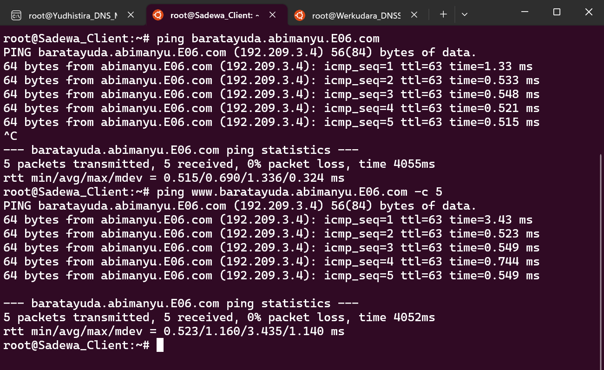

## Nomor 7
### Soal
Untuk informasi yang lebih spesifik mengenai Ranjapan Baratayuda, buatlah subdomain melalui Werkudara dengan akses rjp.baratayuda.abimanyu.yyy.com dengan alias www.rjp.baratayuda.abimanyu.yyy.com yang mengarah ke Abimanyu.

### Jawaban
