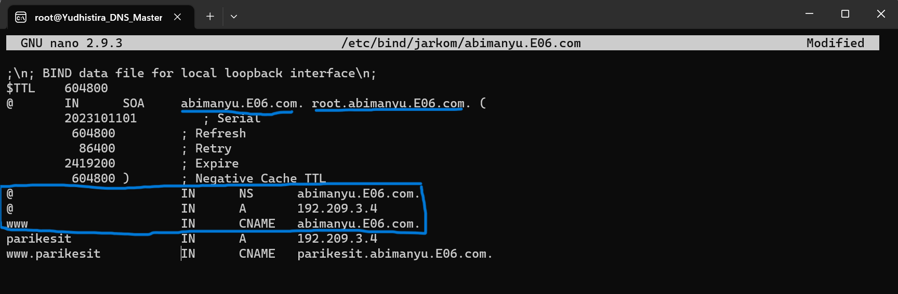

# Jarkom-Modul-2-E06-2023
Berikut adalah repository dari kelompok E06 untuk pengerjaan Praktikum Modul 2 Jaringan Komputer. Repository ini akan berisikan dokumentasi cara pengerjaan tiap soal, screenshot output, dan kendala yang dialami.

# Anggota Kelompok
| Nama | NRP | 
| --- | --- |
| Muhammad Hafidh Rosyadi | 5025211013 |
| Kartika Diva Asmara Gita | 5025211039 |

# Dokumentasi Pengerjaan Soal
## Nomor 1
### Soal
Yudhistira akan digunakan sebagai DNS Master, Werkudara sebagai DNS Slave, Arjuna merupakan Load Balancer yang terdiri dari beberapa Web Server yaitu Prabakusuma, Abimanyu, dan Wisanggeni. Buatlah topologi dengan pembagian sebagai berikut. Folder topologi dapat diakses pada drive berikut 

### Jawaban
Berikut merupakan topologi yang telah kelompok kami buat.


## Nomor 2
### Soal
Buatlah website utama pada node arjuna dengan akses ke arjuna.yyy.com dengan alias www.arjuna.yyy.com dengan yyy merupakan kode kelompok.

### Jawaban
Untuk membuat domain DNS master/Yudhistira dibutuhkan instalasi bind sebagai berikut:

```
apt-get update
apt-get install bind9 -y
```
Kemudian meingisikan konfigurasi pada `/etc/bind/named.conf.local` sebagai berikut:


kemudian buat folder untuk menyimpan domain dalam hal ini adalah `jarkom`. Kemudian lakukan pengkopian template file yang ada di `/etc/bind/db.local` ke file yang tertaut pada konfigurasi diatas.
```
mkdir /etc/bind/jarkom
cp /etc/bind/db.local /etc/bind/jarkom/arjuna.E06.com
```

Kemudian ubah isi file `/etc/bind/jarkom/arjuna.E06.com` menjadi seperti berikut, dengan mengubah localhost menjadi domain yang dituju dan mengubah IP menjadi IP dari arjuna, dan menambahkan alias atau CNAME.


kemudian lakukan restart bind.

```
service bind9 restart
```

Untuk melakukan testing, dapat dilakukan pada client dengan menginstall beberapa hal dan melakukan penyambungan IP, sebagai berikut


kemudian dilakukan ping pada arjuna.E06.com dan www.arjuna.E06.com untuk melakukan testing.


## Nomor 3
### Soal
Dengan cara yang sama seperti soal nomor 2, buatlah website utama dengan akses ke abimanyu.yyy.com dan alias www.abimanyu.yyy.com.

### Jawaban
menambahkan konfigurasi pada `/etc/bind/named.conf.local` sebagai berikut:


Kemudian lakukan pengkopian template file yang ada di `/etc/bind/db.local` ke file yang tertaut pada konfigurasi diatas.

```
cp /etc/bind/db.local /etc/bind/jarkom/abimanyu.E06.com
```

Kemudian ubah isi file `/etc/bind/jarkom/abimanyu.E06.com` menjadi seperti berikut, dengan mengubah localhost menjadi domain yang dituju dan mengubah IP menjadi IP dari Abimanyu, dan menambahkan alias atau CNAME.



kemudian lakukan restart bind.

```
service bind9 restart
```

kemudian dilakukan ping pada abimanyu.E06.com dan www.abimanyu.E06.com untuk melakukan testing.


## Nomor 4
### Soal
Kemudian, karena terdapat beberapa web yang harus di-deploy, buatlah subdomain parikesit.abimanyu.yyy.com yang diatur DNS-nya di Yudhistira dan mengarah ke Abimanyu.

### Jawaban
untuk membuat subdomain perlu dilakukan penambahan pada `/etc/bind/jarkom/abimanyu.E06.com` sebagai berikut:


kemudian lakukan restart bind.

```
service bind9 restart
```

kemudian dilakukan ping pada parikesit.abimanyu.E06.com dan www.parikesit.abimanyu.E06.com untuk melakukan testing.


## Nomor 5
### Soal
Buat juga reverse domain untuk domain utama. (Abimanyu saja yang direverse)

### Jawaban
Menambahkan kofigurasi sebagai berikut pada `/etc/bind/named.conf.local` di Yudhistira:


kemudian mengisi file  `/etc/bind/jarkom/3.209.192.in-addr.arpa` sebagai berikut


kemudian lakukan restart bind.

```
service bind9 restart
```
untuk testing dapat dilakukan dengan command:
```
host -t PTR 192.209.3.4
```


## Nomor 6
### Soal
Agar dapat tetap dihubungi ketika DNS Server Yudhistira bermasalah, buat juga Werkudara sebagai DNS Slave untuk domain utama.

### Jawaban
IP Werkudara dihubungkan dengan Yudhistira pada /etc/bind/named.conf.local di Yudhistira, sebagai berikut:


kemudian lakukan restart bind.
```
service bind9 restart
```

Selanjutnya melakukan setting agar Werkudara menjadi slave pada /etc/bind/named.conf.local di Werkudara.


kemudian lakukan restart bind.
```
service bind9 restart
```
kemudian untuk melakukan testing dapat dilakukan penghentian service dari bind di master/Yudhistira dengan command:
```
service bind9 stop
```
dan dilakukan ping. apabila masih bisa, maka slave telah tersambung.


## Nomor 7
### Soal
Seperti yang kita tahu karena banyak sekali informasi yang harus diterima, buatlah subdomain khusus untuk perang yaitu baratayuda.abimanyu.yyy.com dengan alias www.baratayuda.abimanyu.yyy.com yang didelegasikan dari Yudhistira ke Werkudara dengan IP menuju ke Abimanyu dalam folder Baratayuda.

### Jawaban
#### Yudhistira
Pada `/etc/bind/jarkom/abimanyu.E06.com` tambahkan konfigurasi tambahan sebagai berikut:


Kemudian pada `/etc/bind/named.conf.options`comment `dnssec-validation auto;` dan tambahkan `allow-query{any;};`.


Kemudian ubah konfigurasi `/etc/bind/named.conf.local` menjadi seperti berikut:


kemudian lakukan restart bind.
```
service bind9 restart
```

#### Werkudara
pada `/etc/bind/named.conf.options` comment `dnssec-validation auto;` dan tambahkan `allow-query{any;};`.


Kemudian ubah konfigurasi `/etc/bind/named.conf.local` menjadi seperti berikut:


Kemudian buat direktori `Baratayuda` sesuai dengan nama file yang terhubung dengan konfigurasi diatas dan pindahkan file template pada db.local.

```
mkdir /etc/bind/Baratayuda
cp /etc/bind/db.local /etc/bind/Baratayuda/baratayuda.abimanyu.E06.com
```
kemudian ubah file `/etc/bind/Baratayuda/baratayuda.abimanyu.E06.com` menjadi sebagai berikut:


kemudian lakukan restart bind.
```
service bind9 restart
```

Terakhir lakukan pengetesan pada client.


## Nomor 8
### Soal
Untuk informasi yang lebih spesifik mengenai Ranjapan Baratayuda, buatlah subdomain melalui Werkudara dengan akses rjp.baratayuda.abimanyu.yyy.com dengan alias www.rjp.baratayuda.abimanyu.yyy.com yang mengarah ke Abimanyu.

### Jawaban
Ubah `/etc/bind/Baratayuda/baratayuda.abimanyu.E06.com` menjadi sebagai berikut:


kemudian lakukan restart bind.
```
service bind9 restart
```
Terakhir lakukan pengetesan pada client.


## Nomor 9
### Soal
Arjuna merupakan suatu Load Balancer Nginx dengan tiga worker (yang juga menggunakan nginx sebagai webserver) yaitu Prabakusuma, Abimanyu, dan Wisanggeni. Lakukan deployment pada masing-masing worker.

### Jawaban
#### abimanyu
lakukan pengunduhan resources, dalam hal ini saya unggah resources pada github ini, sehingga dapat dilakukan git clone dan dipindah ke folder `var/www`
```
apt-get update && apt install nginx php php-fpm -y git
git config --global http.sslVerify false
git clone https://github.com/Hfdrsyd/Jarkom-Modul-2-E06

cp -r /Jarkom-Modul-2-E06/Resource/arjuna.yyy.com/arjuna.yyy.com /var/www/arjuna.E06.com
```

kemudian ubah `/etc/nginx/sites-available/jarkom` sesuai dengan root yang telah diisi resource sebagai berikut


kemudian restart.
```
rm -rf /etc/nginx/sites-enabled/default
ln -s /etc/nginx/sites-available/jarkom /etc/nginx/sites-enabled
service php7.2-fpm start
service nginx restart
```

kemudian untuk testing dapat dilakukan 
```
lynx 192.209.3.4
```
akan muncul sebagai berikut


#### prabukusuma
lakukan pengunduhan resources, dalam hal ini saya unggah resources pada github ini, sehingga dapat dilakukan git clone dan dipindah ke folder `var/www`
```
apt-get update && apt install nginx php php-fpm -y git
git config --global http.sslVerify false
git clone https://github.com/Hfdrsyd/Jarkom-Modul-2-E06

cp -r /Jarkom-Modul-2-E06/Resource/arjuna.yyy.com/arjuna.yyy.com /var/www/arjuna.E06.com
```

kemudian ubah `/etc/nginx/sites-available/jarkom` sesuai dengan root yang telah diisi resource sebagai berikut


kemudian restart.
```
rm -rf /etc/nginx/sites-enabled/default
ln -s /etc/nginx/sites-available/jarkom /etc/nginx/sites-enabled 
service php7.0-fpm start ##prabukusuma&wisanggeni 7.0
service nginx restart
```
kemudian untuk testing dapat dilakukan 
```
lynx 192.209.3.5
```
akan muncul sebagai berikut


#### wisanggeni
lakukan pengunduhan resources, dalam hal ini saya unggah resources pada github ini, sehingga dapat dilakukan git clone dan dipindah ke folder `var/www`
```
apt-get update && apt install nginx php php-fpm -y git
git config --global http.sslVerify false
git clone https://github.com/Hfdrsyd/Jarkom-Modul-2-E06

cp -r /Jarkom-Modul-2-E06/Resource/arjuna.yyy.com/arjuna.yyy.com /var/www/arjuna.E06.com
```

kemudian ubah `/etc/nginx/sites-available/jarkom` sesuai dengan root yang telah diisi resource sebagai berikut


kemudian restart.
```
rm -rf /etc/nginx/sites-enabled/default
ln -s /etc/nginx/sites-available/jarkom /etc/nginx/sites-enabled 
service php7.0-fpm start ##prabukusuma&wisanggeni 7.0
service nginx restart
```

kemudian untuk testing dapat dilakukan 
```
lynx 192.209.3.6
```
akan muncul sebagai berikut


## Nomor 10
### Soal
Kemudian gunakan algoritma Round Robin untuk Load Balancer pada Arjuna. Gunakan server_name pada soal nomor 1. Untuk melakukan pengecekan akses alamat web tersebut kemudian pastikan worker yang digunakan untuk menangani permintaan akan berganti ganti secara acak. Untuk webserver di masing-masing worker wajib berjalan di port 8001-8003. Contoh
    - Prabakusuma:8001
    - Abimanyu:8002
    - Wisanggeni:8003

### Jawaban
pada arjuna dapat dilakukan setting sebagai berikut
```
apt-get update
apt-get install bind9 nginx
```
kemudian pada `/etc/nginx/sites-available/lb-arjuna` dapat ditambahkan IP, port, dan server name sebagai berikut


kemudian dilakukan link dan restart
```
ln -s /etc/nginx/sites-available/lb-arjuna /etc/nginx/sites-enabled
service nginx restart
```
kemudian pada masing masing prabukusuma, abimanyu dan wisanggeni diubah port nya pada `/etc/nginx/sites-available/jarkom` sesuai port yang diminta soal:


kemudian masing masing dari node dilakukan restart
```
service nginx restart
```
kemudian dilakukan testing sebanyak 3 kali dengan
```
lynx arjuna.E06.com
```
diperoleh sebagai berikut


## Nomor 11
### Soal
Selain menggunakan Nginx, lakukan konfigurasi Apache Web Server pada worker Abimanyu dengan web server www.abimanyu.yyy.com. Pertama dibutuhkan web server dengan DocumentRoot pada /var/www/abimanyu.yyy

### Jawaban
